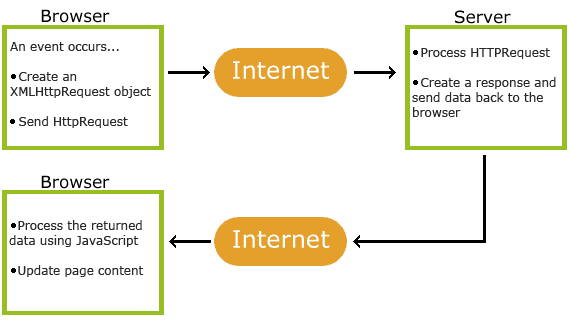

# What is ajax?
**Sources:** 
[w3schools on ajax](https://www.w3schools.com/js/js_ajax_intro.asp)

AJAX is a developer's dream, because you can:
- Read data from a web server - after the page has loaded
- Update a web page without reloading the page
- Send data to a web server - in the background

|How ajax works|
|---|
|1. An event occurs in a web page (the page is loaded, a button is clicked)|
|2. An XMLHttpRequest object is created by JavaScript|
|3. The XMLHttpRequest object sends a request to a web server|
|4. The server processes the request|
|5. The server sends a response back to the web page|
|6. The response is read by JavaScript|
|7. Proper action (like page update) is performed by JavaScript|
